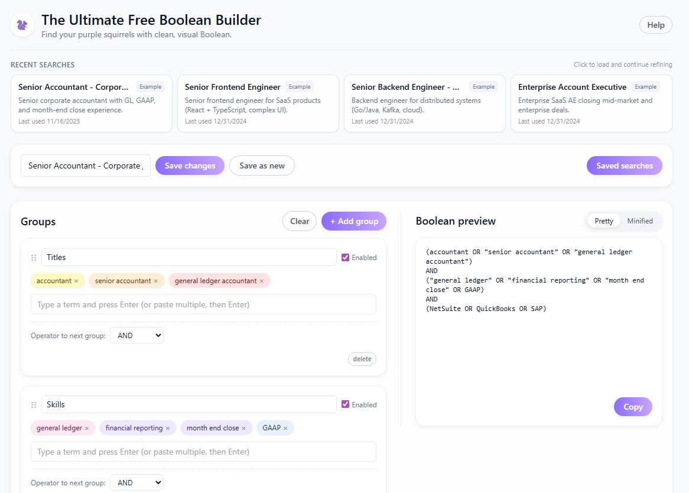

# Boolean Builder (V1.0)

A fast, modern, visual Boolean search builder designed for recruiters, sourcers, and talent teams.  
Create clean Boolean strings using intuitive “groups,” save your searches locally, and reuse them instantly.

Built with **React, TypeScript, Vite, TailwindCSS, shadcn/ui**, and a lightweight custom data layer.

---

## 🌟 Features

### 🎯 Visual Boolean Builder
- Create Boolean searches using **named groups** (formerly “buckets”).
- Add terms as *pills* and organize them visually.
- Automatic generation of valid Boolean strings with:
  - OR within groups
  - AND across groups
  - NOT for exclusion groups
- Real-time Boolean preview panel.

### 💾 Saved Searches
Every search can be saved locally with:
- Name  
- Description  
- Created / Updated timestamps  
- Last Used  
- SerializedBuilderState  
- Generated query string

Full support for:
- **Save**
- **Save Changes**
- **Save As New**
- **Delete**
- **Rename**
- **Edit description inline**
- **Usage tracking**

### 🧭 Recent Searches
Shows your **4 most recently used** searches with:
- Name
- Description
- Example tag
- Last used date
- Stable ordering unless the membership changes

### 📝 Detailed Help Panel
Built-in help explaining:
- How the tool works
- What Boolean logic is
- Examples of recruiter-friendly queries
- Tips for sourcing
- App architecture  
- Link to GitHub profile

### 📥 Import & Export
- **Export all** saved searches as JSON  
- **Import & replace** via file upload  
- Automatic versioning and validation  
- Useful for sharing templates or backing up your work

### 🚀 Built-in Examples
The app ships with six real-life searches:
- Senior Frontend Engineer
- Senior Backend Engineer (Distributed Systems)
- Enterprise Account Executive
- Sales Development Representative
- Registered Nurse (ER)
- Senior Accountant (GL)

Examples behave exactly like normal saved searches—rename, edit, or delete them freely.

---

## 🛠 Tech Stack

This app is intentionally lightweight and fast:

| Layer | Details |
|-------|---------|
| Framework | React + TypeScript |
| Build System | Vite |
| Styling | TailwindCSS |
| UI Components | shadcn/ui + Radix primitives |
| Icons | lucide-react |
| State | React hooks |
| Storage | localStorage (JSON) |
| Routing | None (single-screen app) |

All state is 100% client-side.  
No backend. No tracking. No cookies.

---

## 📦 Project Structure

src/
components/
SavedSearchPanel.tsx
HelpPanel.tsx
GroupEditor.tsx
RecentSearches.tsx
...other UI components
hooks/
useSavedSearches.ts
useBuilderState.ts
lib/
savedSearches.ts
booleanGenerator.ts
data/
exampleSearches.ts
styles/
globals.css
App.tsx
main.tsx

---

## 🧩 Key Components & Architecture

### `useSavedSearches`
A custom hook that manages:
- Save
- Update
- Delete
- Replace all
- Export all
- Loading from localStorage
- Recency tracking
- One-time example seeding

### `useBuilderState`
Manages the logical structure of a Boolean search:
- Groups
- Pills
- Order
- Operators
- SerializedBuilderState for saving/loading

### `SavedSearchPanel`
Side drawer with:
- Filtering
- Inline rename
- Inline description editing
- Delete (trash icon)
- Example badges
- Import/export footer

### `HelpPanel`
Readable, “mini-document” UI with:
- Concepts
- Boolean basics
- Recruiter tips
- Tech overview
- GitHub link

### `RecentSearches`
Polished card grid for recents with stable ordering.

---

## 🧪 Development

### Install dependencies

npm install

### Run locally

npm run dev

Runs on Vite’s dev server with hot reloading.

### Build for production

npm run build

### Preview production build

npm run preview

---

## 🚀 Deployment

You can deploy **as-is** to:

- Netlify  
- Vercel  
- GitHub Pages  
- Cloudflare Pages  
- Any static host

The output is a self-contained static site.

### Basic Vercel deploy

Just run: vercel deploy

### GitHub Pages

npm run build

Push dist/ via gh-pages:

npm install gh-pages --save-dev
npm run build
npx gh-pages -d dist

## 🔒 License

This project is licensed under the Polyform Noncommercial License 1.0.0.
See LICENSE file for full text.

### You may:
- View
- Use
- Modify
- Fork
As long as it is noncommercial.

### 👤 Author

Created by Ed P.
GitHub: https://github.com/SomeGuy02312